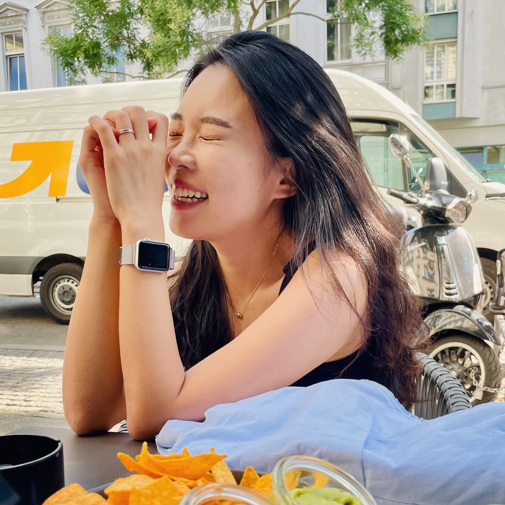

  Hi, I am a master's student in Scientific Computing at Technische Universität Berlin. At the same time, I am working at [ZIB](https://www.zib.de/) as a student assistant in the Laboratory for Interactive Optimization and Learning, supervised by [Prof. Sebastian Pokutta](https://iol.zib.de/).    

I received M.Sc. in applied mathematics from Pusan National University in rep. of Korea, and at the same time, I had worked at the Industrial Mathematics Center as a student research associate.

[[cv](./assets/file/cv.pdf)]        

Last modified: Sep. 10, 2021

