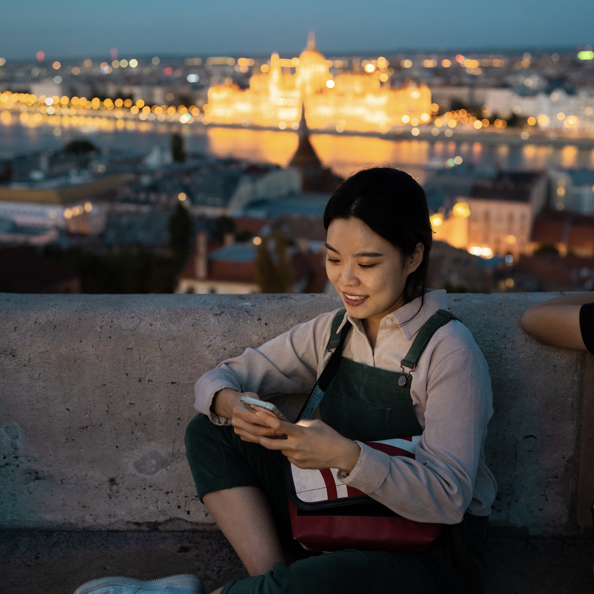

  Hi, I am a master's student in Scientific Computing at Technische Universität Berlin. At the same time, I am a student assistant in [IOL](https://iol.zib.de/) at [ZIB](https://www.zib.de/).    

I received M.Sc. in Applied Mathematics from Pusan National University in South Korea and worked as a research assistant at the Industrial Mathematics Center. [[CV](./assets/file/cv.pdf)]

        

Last modified: Feb. 6, 2024

